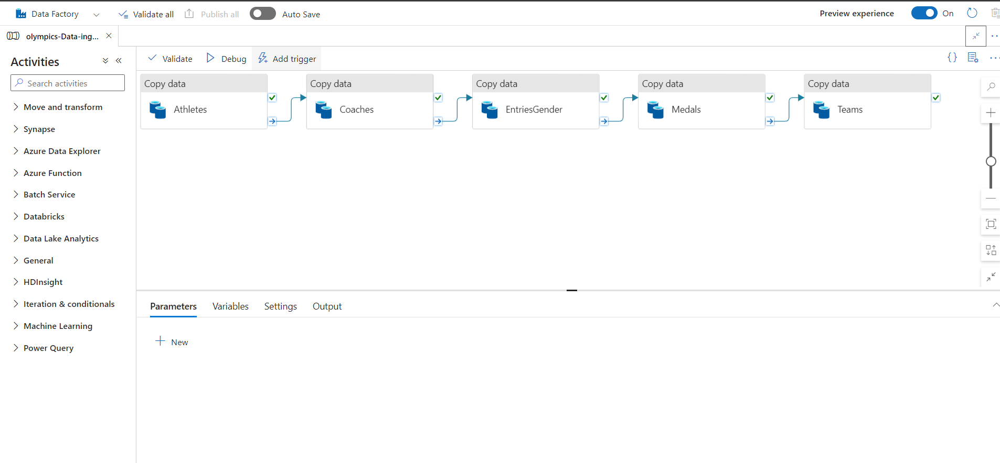

# Analyzing Olympic Data Using Azure Services

In this detailed technical overview, we will dive deep into how we effectively utilized a range of Azure services for our comprehensive Olympic data analysis.

## Data Flow Overview

1. **Data Collection**: Using Azure Data Factory, we orchestrated a pipeline that fetched JSON data from an HTTP source and stored it in Azure Blob Storage.

2. **Data Transformation**: Leveraging Azure Databricks, we performed data transformation using Apache Spark. This step involved converting the raw JSON data into a structured format for analysis.

3. **Data Warehousing**: Azure Synapse Analytics played a crucial role in creating a structured data warehousing solution. We designed a database schema and tables optimized for analytical queries.

4. **Data Visualization**: Power BI came into play as we ingested data from Blob Storage. We then crafted interactive dashboards for visualizing insights from the data.

## Azure Services Utilized

- **Azure Blob Storage**: Used as both a landing zone and a storage repository for raw and processed data.

- **Azure Data Factory**: Orchestrated the data movement process, fetching JSON data over HTTP and storing it in Blob Storage.

- **Azure Databricks**: Employed for data transformation tasks, leveraging the parallel processing capabilities of Apache Spark.

- **Azure Synapse Analytics**: Created a structured database and tables to optimize query performance for analytical workloads.

- **Power BI**: Connected to Blob Storage to create interactive dashboards, facilitating data exploration and visualization.

## Implementation Steps

1. **Data Collection**: Consult Azure Data Factory documentation to set up a pipeline that fetches JSON data from an HTTP source and deposits it in Blob Storage.

2. **Data Transformation**: Learn how to use Azure Databricks notebooks to process and transform data with Spark.

3. **Data Warehousing**: Follow Azure Synapse Analytics documentation to design a database schema and tables aligned with your analytical goals.

4. **Data Visualization**: Explore Power BI to connect to your data in Blob Storage and craft insightful dashboards.

## Conclusion

By skillfully integrating Azure services, we successfully built an end-to-end pipeline for Olympic data analysis. The combined strength of Azure Blob Storage, Data Factory, Databricks, Synapse Analytics, and Power BI allowed us to collect, transform, warehouse, and visualize data efficiently.

## Pipeline

## Dashboard

